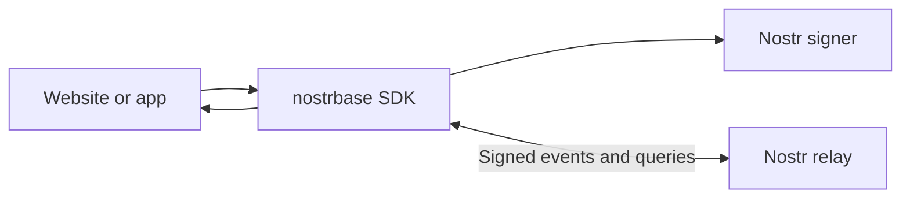

# nostrbase

A Supabase-style TypeScript SDK for Nostr apps, built on **Applesauce**.

## How does it work?

It translates familiar database calls into **signed Nostr events**. Applesauce handles signing, relay connections, and the local event store.



### 1. Create a client

```ts
import { createClient } from "nostrbase";

const db = createClient({
  namespace: "my-app",
  relays: ["wss://your-relay.example"],
});

await db.auth.signInWithExtension();
```

The namespace identifies your app's data. Sign-in connects a Nostr signer. The user's public key is their identity.

### 2. Write a record

```ts
await db.from("todos").insert({
  id: "task-1",
  title: "Build my website",
  done: false,
});
```

The SDK:

1. Converts the record to JSON.
2. Creates a kind `30078` Nostr event.
3. Adds tags for the app, table, and record ID.
4. Requests the user's signature.
5. Sends the event to the relays and collects their responses.

A record's identity is **app + table + author + ID**.

### 3. Read records

```ts
const { data, error } = await db
  .from("todos")
  .select()
  .eq("done", false);
```

The SDK requests table events from the relays, verifies signatures, and selects the latest version of each record. It then applies field filters and returns normal JavaScript objects.

Author and ID filters run on the relay. Field filters and sorting run on the client. Cursor pages narrow relay requests by time, then resolve the latest record versions before selecting rows.

### 4. Update and delete

An update publishes a new signed event at the same record address. The latest version wins.

A delete publishes a NIP-09 deletion request. The SDK hides the targeted record; relays decide how they handle stored copies.

### 5. Receive live changes

Channels keep a relay subscription open. The SDK compares incoming events with its local state and emits `INSERT`, `UPDATE`, or `DELETE`.

Broadcast and Presence use signed, public ephemeral events. Negentropy (NIP-77) recovers stored records missed during a disconnect. Ordinary queries provide recovery when a relay does not support it.

### 6. Work offline or keep personal data private

```ts
import { IndexedDBPersistenceAdapter } from "nostrbase";

const db = createClient({
  namespace: "my-app",
  relays: ["wss://your-relay.example"],
  persistence: { adapter: new IndexedDBPersistenceAdapter("my-app-cache") },
  sync: { tables: ["todos"], initial: true, reconnect: true },
});

await db.auth.signInWithExtension();
await db.ready();

await db.from("todos").insert({ title: "Work offline", done: false }).queue();
await db.offline.flush(); // Explicitly send saved signed writes when connected.

await db.private.from("notes").insert({ text: "Only for me" });
await db.closeAsync(); // Finish pending cache writes before closing.
```

Private tables encrypt the record body to the user's own key with NIP-44. The signer must support NIP-44. Relays still see the author, app, table, record ID, and timestamps. Public and private tables use separate addresses.

**Your app needs no separate application server for these record operations.** Relays provide storage and delivery. Files use a separate Blossom HTTP server. Authors edit their own records; application rules run in the client.

## Which Supabase features are available?

The SDK provides the familiar client API and the following Nostr equivalents. These features do not supply PostgreSQL guarantees or the full Supabase platform.

| Supabase feature | Available? | SDK behavior |
| --- | --- | --- |
| TypeScript client | ✅ | `createClient`, typed tables, `{ data, error }` results |
| Insert, read, update, delete | ✅ | Records stored as signed Nostr events |
| Upsert | ✅ | Creates or replaces an author's record |
| Filters and field selection | ✅ | Common filters and typed projections |
| Sorting and pagination | ✅, with limits | Local sorting/ranges and newest-first cursor pages; relay results can be incomplete |
| Authentication | Partial | Extension, private key, or Applesauce remote signer |
| Live database changes | ✅ | `INSERT`, `UPDATE`, `DELETE` subscriptions |
| Realtime Broadcast | ✅ | Signed public ephemeral channel messages |
| Realtime Presence | ✅ | Public session state, heartbeats, and expiry; approximate |
| Reconnect recovery | ✅ | Pull missing records with Negentropy; ordinary query fallback |
| File storage and uploads | ✅, external service | Blossom upload, download, list, and delete with hash checks |
| Image transformations | ❌ | Not implemented |
| Edge Functions / RPC | ❌ | Not implemented |
| PostgreSQL and SQL | ❌ | Uses Nostr events |
| Joins and foreign keys | Partial | Author-scoped references resolved on the client; no enforced foreign keys or SQL joins |
| Transactions | ❌ | Writes can succeed independently |
| Global uniqueness constraints | ❌ | Record identity includes the author |
| Row Level Security | Partial equivalent | Author ownership checks; no configurable server access policies |
| Email/password, OAuth, magic links, MFA | ❌ | Nostr signer auth only |
| Private tables | ✅, personal | Self-encrypted NIP-44 records; no shared private tables or group key management |
| Full-text search | Partial | Local table text search; NIP-50 raw event search on supporting relays |
| Vector search | ❌ | Needs a separate index/service |
| Schema validation | ✅, client-side | Zod or custom validators and inferred types; no relay-enforced schema |
| Data migrations | ✅, client-side | Validate transformations, preview, and sign rewrites of your own records |
| Backups | ✅, local | Export/import verified cached events and tombstones; no automatic republishing |
| Dashboard and logs | ✅, local | Read-only cache inspector and bounded SDK diagnostics |
| Offline persistence and write queue | ✅ | IndexedDB cache and explicit signed queue/replay; memory by default |

Two distinctions matter:

- **Auth identifies who signed a record.** It does not restrict who can read public records.
- **Queries operate over relay results.** They do not guarantee a complete global table.

You can build todo apps, profiles, feeds, directories, personal encrypted notes, and apps that attach files. Shared private collaboration, transactions, server functions, global constraints, and server-enforced business rules need more infrastructure or protocols.

## Start building

Version **0.2.0** supports modern browsers and Node **22.12+** as an ESM package. It is available locally and has not been published to npm.

See the [API and setup guide](docs/api.md) for installation, typed schemas, auth, queries, channels, and relay write receipts. See the [examples](examples/README.md), [record protocol](docs/protocol.md), and [contributor guide](CONTRIBUTING.md) for more detail.

Feature guides: [Broadcast and Presence](docs/realtime.md), [offline cache and Negentropy](docs/offline-sync.md), [private records and Blossom](docs/private-storage.md), and [search and developer tools](docs/tooling.md).

Try [Fieldwork](examples/fieldwork/README.md), a complete example app with a project board, private notebook, files, live updates, and offline writes. It consumes the packed SDK and has real browser tests against independent local services. See its [developer experience report](examples/fieldwork/DEVELOPER-EXPERIENCE.md).

Verification: [test contracts](docs/testing.md), [separate environment projects](integration/README.md), and [local results](docs/verification.md).

## Documentation site

Run `npm ci --prefix site`, then `npm run docs:dev` for the full documentation site at `http://127.0.0.1:4321`. Build static HTML with `npm run docs:build`. See the [documentation index](docs/README.md) for setup and authoring.
