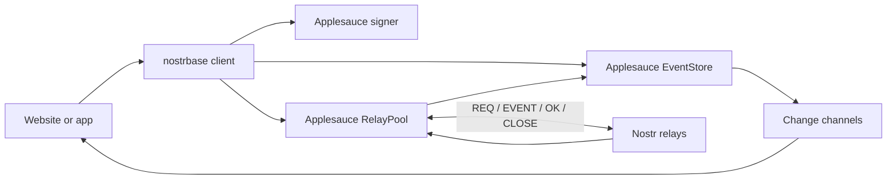

# Record protocol v1

This protocol maps table records to NIP-78 application data events. It uses the NIP-01 replacement rule and NIP-09 deletion requests. SDK 0.2.0 keeps public record wire version 1 and adds the formats below.

## Event format

```json
{
  "kind": 30078,
  "created_at": 1700000000,
  "tags": [
    ["d", "nostrbase:com.example.todos:todos:task-42"],
    ["t", "nostrbase:com.example.todos:todos"],
    ["t", "nostrbase:com.example.todos:todos:done:false"]
  ],
  "content": "{\"v\":1,\"namespace\":\"com.example.todos\",\"table\":\"todos\",\"id\":\"task-42\",\"createdAt\":1700000000,\"data\":{\"title\":\"Build it\",\"done\":false}}"
}
```

The usual `id`, `pubkey`, and `sig` fields are added by the signer.

Construct a scope as `nostrbase:${encodeURIComponent(namespace)}:${encodeURIComponent(table)}`. Construct `d` as `${scope}:${encodeURIComponent(recordId)}`. Namespace and table names must contain 1–256 characters; record ids must contain 1–512 characters. Names are used exactly as supplied.

An indexed field adds a `t` tag with `${scope}:${encodeURIComponent(field)}:${encodeURIComponent(JSON.stringify(value))}`. JSON values must be finite numbers, strings, booleans, null, arrays, or plain objects. `undefined`, functions, dates, binary objects, bigint, and circular structures are rejected. The keys `id` and `_nostr` are reserved in record data.

A reader must validate the signature, kind, namespace, table, protocol version, `d` tag, scope tag, record id, and creation timestamp before exposing the data. It should use a schema validator when the app requires fixed field types. `createdAt` must be a nonnegative integer no greater than the event timestamp.

## Identity and versions

The address is `30078:<pubkey>:<d>`. Author identity comes from the signed public key, not the JSON body. IDs are unique within one author's table address.

Choose the highest `created_at`. If timestamps are equal, choose the lowest lexicographic event id. Filter record fields after resolving versions. Preserve the original `createdAt` during an update; a recreation after deletion begins a new record lifetime.

The SDK serializes writes within a client and selects a timestamp greater than its known prior version or deletion. This prevents two rapid writes in the same client from losing their order. It does not provide a lock between devices, compare-and-swap, or distributed transactions.

## Deletion

A deletion request uses kind 5 and includes:

```json
[
  ["t", "nostrbase:com.example.todos:todos"],
  ["k", "30078"],
  ["e", "<current-event-id>"],
  ["a", "30078:<author>:nostrbase:com.example.todos:todos:task-42"]
]
```

The signer must be the record author. The request timestamp must be no earlier than the targeted event. Readers track the highest deletion timestamp for an address and targeted event ids, so stale versions cannot restore deleted data. A newer signed event at the same address can create a new record.

Table reads request scoped deletion events, then request deletion events by `a` and `e` pointers in batches of up to 100 records. Pointer requests accept deletion events from other clients that omit the scope tag. A relay that neither removes targeted records nor supplies deletion events cannot provide an accurate view of deletion state.

## Personal encrypted records

Private records retain kind `30078` and the same plaintext JSON envelope. Encrypt that envelope to the author's own key using NIP-44. Store only ciphertext in `content`. Use `private:<table>` as the wire route in the scope and `d` tags, with the original table name inside the encrypted envelope. Add `["encryption", "nip44-self"]`. Do not add field index tags.

For example, a private `todos` record has scope `nostrbase:com.example.todos:private%3Atodos`, plus a `d` tag formed from that scope and the record ID. Private and public addresses are distinct. The SDK reserves the `private:` prefix in user table names; internal routes can be up to 264 characters before encoding.

Verify the signed ciphertext first. The author decrypts it, validates the envelope and its route, and applies the table schema. Never add a reconstructed plaintext event to the EventStore. Private deletes use the private route and the same author/pointer rules. Routing metadata remains public. This format supports personal records, not group key distribution.

## Ephemeral channels

Broadcast and Presence use signed kind `20078` events. The `t` scope is `nostrbase:channel:<encoded namespace>:<encoded channel>`. Add a NIP-40 `expiration` tag. The JSON body includes `v: 1`, `namespace`, `channel`, `sessionId`, `sequence`, and `type`.

- Broadcast bodies add `event` and `payload`.
- Presence bodies add `state`: a JSON object for tracking or `null` for leaving.

Readers verify signatures, scope, body version, expiry, and ordering. Presence expires locally and is refreshed by heartbeats. These are public ephemeral messages. They are not persisted, queued, or recovered by Negentropy. See [realtime](realtime.md) for timing and lifecycle rules.

## Cache, replay, and recovery

Persistence stores signed original events and deletion tombstones, including private ciphertext. Restore deletes before records. A signed queue persists exact events before exposing optimistic local changes. Replay keeps their IDs, timestamps, signatures, and author; it requires the active account to match and collects relay acknowledgements.

NIP-77 reconciliation uses Applesauce Negentropy with a locally filtered event ID/timestamp vector. The SDK fetches and verifies missing remote events. It does not publish local-only events. Ordinary Nostr queries recover data when reconciliation fails or is unsupported. Record pointer queries also recover unscoped deletion requests. See [offline and sync](offline-sync.md).

Blossom files are separate HTTP objects, addressed by SHA-256. Signed authorization uses ephemeral kind `24242`; file bytes are not NIP-78 table bodies. See [private records and storage](private-storage.md).

## SDK components



- `auth.ts`: in-memory signer sessions, NIP-07, and generic Applesauce signers.
- `protocol.ts`: record encoding, decoding, signatures, addresses, and deletion templates.
- `transport.ts`: bounded Applesauce reads, publications, and streams.
- `query.ts`: immutable awaitable builders, field predicates, projection, and cardinality.
- `client.ts`: version materialization, author ownership, serialized writes, receipts, and lifecycle.
- `channel.ts`: cached state, initial inserts, changes, deduplication, and observer lifecycle.
- `events.ts`: access to standard Nostr events.

The client verifies events from custom transports before adding them to the store. A custom transport must report one status per configured relay, respect timeouts and cancellation, and release its connections when subscriptions end. The SDK does not close a supplied transport.

## Scope and scaling

This SDK provides public and personal encrypted records for client apps. A table query can fetch all matching retained events. Filters narrow by namespace, author, record ID, and cursor timestamp. Candidate addresses are refreshed before cursor selection. Field filters and final row selection operate over the materialized cache. EOSE does not prove a complete global table.

A namespace is a data label, not an access boundary. An author signature proves origin, not approval or truth. Use trusted-author rules in the app when a collection needs moderation or curated content.

For a large app, design narrower collections, choose suitable relays, and manage storage usage. History and tombstones currently have no automatic eviction. Channels also subscribe to kind-5 events for cross-client deletion support. There is no automatic outbox discovery, shared private authorization, or server policy layer.

## Compatibility

The wire version is `v: 1`; unknown versions are ignored. A future wire change needs an explicit migration or a new version. During the 0.x SDK series, patch releases preserve documented contracts; a minor release may change the API with release notes. Package consumers should review 0.x minor updates.
